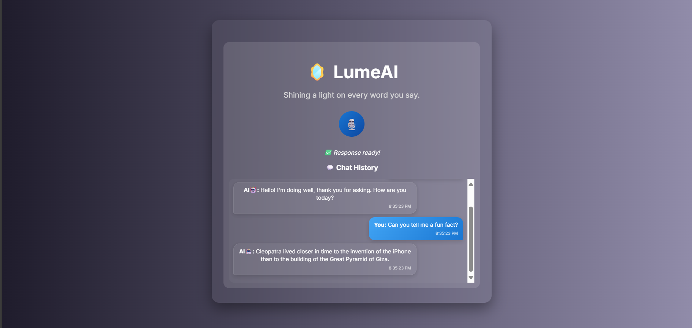
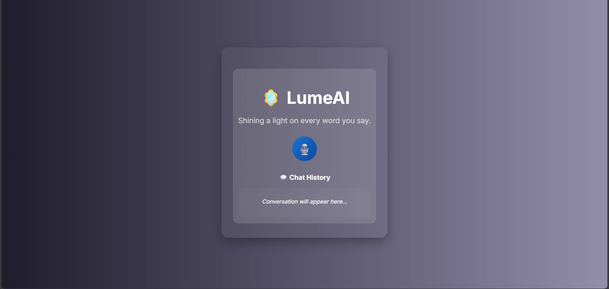
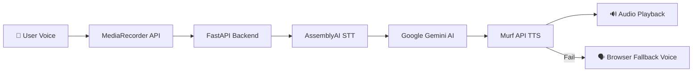

<h1 align="center">🪞 LumeAI</h1>
<p align="center">
  <b>Shining a light on every word you say.</b>  
</p>

<p align="center">
  
  
  
  
</p>
<p align="center">
  
</p>
<p align="center">
  
</p>

---

## ✨ Features
- 🎙 **One-Click Voice Recording** with animated mic button
- 🧠 **Memory-Powered Conversations** per session
- 🔊 **Natural AI Speech** via Murf API
- 🗣 **Browser Voice Fallback** when TTS fails
- 📜 **Live Chat History** with timestamps
- ⚡ **Fast Speech-to-Text** via AssemblyAI
- 🤖 **Contextual AI Replies** from Google Gemini API

---

## 🛠 Tech Stack

### **Frontend**
- **HTML5**, **CSS3**, **JavaScript (Vanilla)**
- Web Speech API *(for fallback TTS)*
- MediaRecorder API *(for audio capture)*

### **Backend**
- **Python 3.10+**, **FastAPI**
- [Murf API](https://murf.ai) — Text-to-Speech  
- [AssemblyAI](https://www.assemblyai.com) — Speech-to-Text  
- [Google Gemini API](https://ai.google) — AI Responses

---

## 🏗 Architecture


## 📸 Screenshots
- 💬 LumeAI

- 🎙 Chat Interface


- 🚀 Now the voice agent **feels like a real app**, not just a prototype

---

## ⚙️ What You’ll Need

- **FastAPI** (Python)
- **Murf AI API key**
- **AssemblyAI API key**
- **Google Gemini API key**
- HTML, CSS, JS frontend
- `.env` file to store keys

---

## 💡 Tools I'm Using

| Tool             | Purpose                             |
| ---------------- | ----------------------------------- |
| Murf AI          | Text-to-Speech (TTS)                |
| FastAPI          | Backend API server                  |
| HTML/CSS/JS      | UI for interaction and playback     |
| MediaRecorder    | Echo Bot mic capture + playback     |
| FormData         | Uploading audio blob to the backend |
| AssemblyAI / STT | Transcribing recorded audio         |
| Gemini API       | AI-generated conversation           |

---

# 🛠 Installation & Run Instructions

### 📂 Project Structure

```
LumeAI/
│── main.py              # FastAPI backend
│── templates/
│   └── index.html        # Frontend HTML
│── static/
│   ├── css/style.css     # Styles
│   ├── js/script.js      # Client logic
│   └── favicon.ico
│── uploads/              # Recorded audio
│── .env                  # API keys (ignored by Git)
│── requirements.txt
│── README.md

```

---

### 🔑 API Keys

Create `.env` file in root:

```env
MURF_API_KEY=your_murf_api_key
ASSEMBLY_API_KEY=your_assemblyai_api_key
GEMINI_API_KEY=your_gemini_api_key
```

---

### 📥 Installation Steps

1️⃣ **Clone the repo**

```bash
git clone https://github.com/Vishalpandey1799/Murf-AI-Voice-Agent.git
cd Murf-AI-Voice-Agent
```

2️⃣ **Create and activate virtual environment**

- **Windows:**

```bash
python -m venv .venv
.venv\Scripts\activate
```

- **Mac/Linux:**

```bash
python3 -m venv .venv
source .venv/bin/activate
```

3️⃣ **Install dependencies**

```bash
pip install -r requirement.txt
```

4️⃣ **Run the FastAPI server**

```bash
uvicorn main:app --reload
```

---

## 🙌 Special Thanks

Huge thanks to **Murf AI** for organizing this amazing challenge and encouraging builders to explore the world of voice-first interfaces.
Your tools are enabling the next generation of interactive agents 💜

---

## 🔗 Follow My Progress

📍 Catch my updates on LinkedIn with: [#30DayVoiceAgent](https://www.linkedin.com/in/bhavesh-chouhan-n01/)
Let’s build cool voice stuff together!

---
